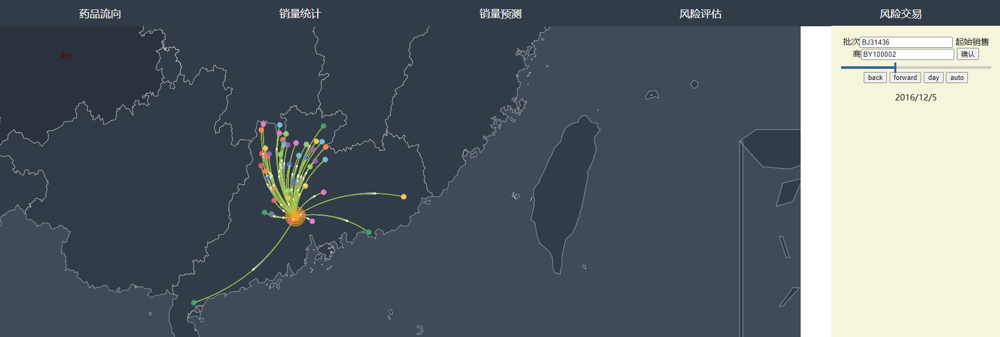
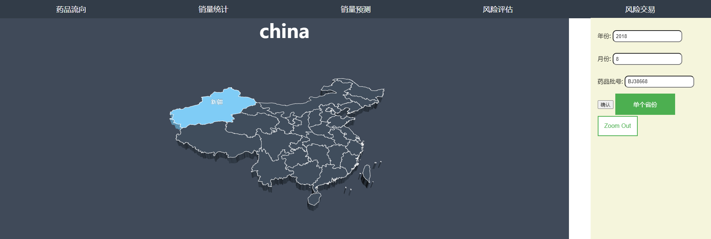
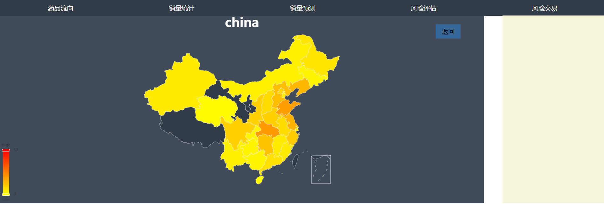
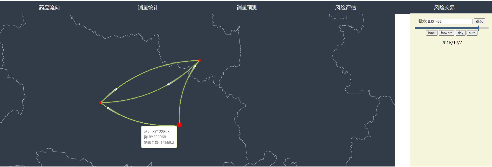

## 数据前端可视化与交互实现

### 实现明细

* 采用的可视化框架：Echart.js
* 编程语言：html、js、css
* 详细：可视化采用的主要基础组件包括：echart中的geo、geo3d，并在此之上，使用line、scatter、3dBar、visualMap等组件，实现了流向图、柱状图、热力图等具体的数据展现形式，通过重写echart中鼠标监听事件完成用户交互。

### 可视化布局

##### 药品流向数据

* 数据展示形式：2d流向图

  在2d的地理地图上，使用原点标出药品经销商的具体位置，使用曲线与流动动画表示药品的买卖方向，展示整个药品在进销商网络中随时间进行的流动过程

  需要用户输入

  * 药品批号
  * 开始经销商身份

* 交互：
  * 在鼠标移至原点上时，使用移动窗口的方式展示经销商或的具体信息（进销商的唯一身份ID）。
  * 在鼠标移至线条上时，使用移动窗口的方式展示药品买卖的具体信息（买卖方的身份ID与本次买卖的具体金额）。
  * 用户可以手动在右侧调节当前所显示的药品记录的事件范围，也可选择自动播放类型，让地图中的买卖记录随着时间流动自行变化。

##### 药品销售统计

* 数据展示形式：3d柱状图

  在3d的地理地图上，使用高度与销量相关的柱状图展示不同区域在某个时段中对于某批次药物的销售情况，采用了不同的颜色大小表示经销商的不同等级。

  需要用户输入：

  * 药品批号
  * 统计时段

* 交互

  * 用户可以通过右侧区域选择列表，选择展示某个特定的省份中，不同城市对于某款药品的销售情况
  * 也可以点击返回按钮，查看全国的所有省份，对于某款药品的销售情况
  * 鼠标移至柱状图上时，会显示对应区域的具体销售情况

##### 区域风险估计

* 数据展示形式：2d热力地图

  在2d的地理图上，根据不同区域的风险数值，采用不同的颜色标注不同的区域 ， 展示不同区域的药物销售风险大小。

* 交互

  * 用户点击某个省份时，会显示对应省份中不同城市的风险程度。

##### 经销商风险买卖检测

* 数据展示形式：2d流向图

  在2d流向图中，使用原点标出药品经销商的具体位置，使用曲线与流动动画表示药品的买卖方向，展示某一批药物的全部流通过程中，可能的经销商违规流通操作，全部显示的经销商均为红色，以不同的大小区分经销商的级别。

  需要用户输入：

  * 药品批号

* 交互

  * 鼠标移至原点上时，使用移动窗口的方式展示经销商或的具体信息（进销商的唯一身份ID）。
  * 在鼠标移至线条上时，使用移动窗口的方式展示药品买卖的具体信息（买卖方的身份ID与本次买卖的具体金额）。
  * 用户可以手动在右侧调节当前所显示的药品记录的事件范围，也可选择自动播放类型，让地图中的买卖记录随着时间流动自行变化。

##### 区域销量预测

* 数据展现形式：2d地图与2d折线图

  通过在2d地图上让用户选择不同的区域，在折线图中展示未来给定区域的预测销售情况

* 交互：

  * 鼠标点击对应区域，在折线图中显示对应区域的未来销量预测
  * 用户可以通过右侧的选择框，选择预测区域的大小